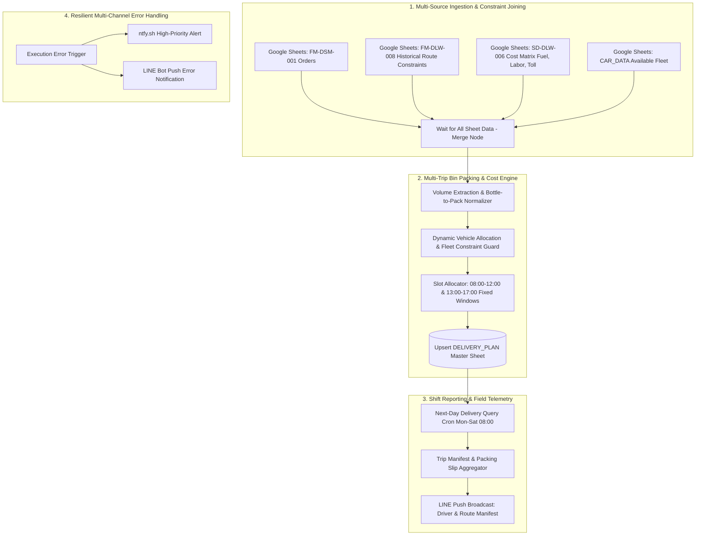

# Logistics Dispatch Planning & Reporting

[](https://n8n.io/)
[](https://developer.mozilla.org/)
[](https://developers.google.com/sheets/api)
[](https://developers.line.biz/)

Two n8n workflows allocate delivery quantities across a fleet using capacity, trip cost, working-hour, and packaging rules, then prepare LINE dispatch manifests.

---

## 📌 System Architecture



---

## ⚙️ Core Technical Highlights

### 1. Multi-Dimensional Constraint Joining & Bin-Packing
* **Heterogeneous Volume Capacity Rules:** Automatically extracts container volume (ml) from unstructured product titles/SKUs and applies capacity rules across 3 fleet categories:
  * **Pickup Truck (4W):** 4,000–8,000 bottles
  * **Medium Truck (6W):** 24,000–35,000 bottles
  * **Trailer (6W+6W):** 48,000–70,000 bottles
* **Greedy Cost Minimization:** Evaluates multi-trip completion. If a trip fulfills the backlog completely, it prioritizes the lowest total trip cost; otherwise, it optimizes by the lowest cost per delivered bottle.
* **Driver Working Hour Constraint:** Restricts daily vehicle utilization to **at most 8 hours/day** and **at most 3 trips/vehicle/day**, factoring in trip distance against vehicle-specific speed models (Pickup: 90 km/h, 6W: 80 km/h, Trailer: 55 km/h).

### 2. Deterministic Packaging Manifest Conversion
* Evaluates SKUs against a static master specification map of over 100 packaging variations (`FIXED_BOTTLE_PER_PACK`).
* Computes complete packages and remaining units deterministically:
$$\text{Full Packs} = \left\lfloor \frac{\text{Quantity}}{\text{BottlePerPack}} \right\rfloor, \quad \text{Remainder} = \text{Quantity} \pmod{\text{BottlePerPack}}$$

### 3. Shift Time-Slotting & Operation Scheduling
* Standardizes daily schedules for vehicles assigned exactly 2 trips per day to standard operating windows:
  * **Trip 1:** 08:00 – 12:00
  * **Trip 2:** 13:00 – 17:00
* Employs non-blocking queue progression for custom multi-trip routing.

### 4. Resilient Multi-Channel Observability
* Utilizes n8n Error Triggers coupled with **ntfy.sh (Priority: High)** and **LINE Bot Push API (Max retries: 3)** to capture and deliver execution errors, workflow IDs, and timestamps immediately to engineers.

---

## 📂 Workflow Directory

```text
├── workflows/
│   ├── dynamic-logistics-optimizer.json
│   └── dispatch-telemetry-reporter.json
└── README.md
```

| Workflow File | Role | Triggers | Key Responsibilities |
| :--- | :--- | :--- | :--- |
| `dynamic-logistics-optimizer.json` | Master Logistics Planner | Saturday 06:00 BKK / Manual | Ingests orders, fleet data, and cost matrices; solves multi-trip allocation; upserts master delivery plan. |
| `dispatch-telemetry-reporter.json` | Telemetry & Field Manifest Push | Mon-Sat 08:00 BKK / Manual | Audits tomorrow's planned trips, resolves SKU packaging slips, and broadcasts manifests to LINE operations. |

---

## 🚀 Setup & Deployment

### Prerequisites
1. **n8n Instance** (with node versions compatible with the exported workflows)
2. **Google Workspace Service Account / OAuth2** (Google Sheets scope)
3. **LINE Messaging API Developer Channel**

### Import Workflows
1. Clone this repository:
   ```bash
   git clone https://github.com/Panutle/logistics-dispatch-optimizer.git
   cd logistics-dispatch-optimizer
   ```
2. In your n8n interface, select **Workflows** > **Import from File**.
3. Import the 2 JSON files from the `workflows/` directory.
4. Link your Google Sheets and LINE API credentials within each respective node.


## Reproduction notes

This repository contains workflow exports. The source spreadsheets, operational datasets, credentials, and connected services must be supplied separately.

1. Import the JSON files with the workflows inactive and resolve any unavailable node types.
2. Rebind credential references to accounts in your own n8n instance.
3. Replace document IDs, sheet names, folder IDs, webhook endpoints, LINE recipient IDs, and embedded configuration in both Code and HTTP Request nodes. Credential binding alone is not enough.
4. Match sheet headers and data types to the field names read by the workflow; there is no automatic source-schema provisioning.
5. Run a representative input against test destinations and inspect the extracted records or generated plan. Verify the workflow timezone and alert recipients before enabling schedules.

Provide order, route, fleet, packaging, and cost data matching the columns used by the planner. The greedy allocation heuristic does not establish a globally optimal vehicle-routing solution.

The exports demonstrate implementation choices; this repository does not include a reproducible benchmark for accuracy, time savings, or production availability.
